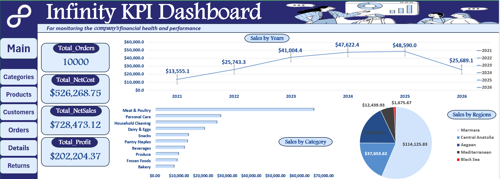

# Retail / Supermarket Data Analysis

A retail supermarket data analysis project using Python, Pandas and Excel to understand business performance across sales, profit, customers, products, orders and returns

## Project Overview

The goal of this project was to analyze supermarket data and extract useful business insights instead of just creating visualizations

The project included data cleaning, exploratory data analysis, joining and merging multiple tables, KPI calculations, business analysis and finally building an interactive Excel dashboard

## Dataset

The data consists of 5 related tables

- Categories — 10 categories
- Products — 100 products
- Customers — 1,000 customers
- Orders — 10,000 orders
- Order Details — 30,271 records

## Tools Used

- Python
- Pandas
- Jupyter Notebook
- Excel
- Data Cleaning
- Exploratory Data Analysis
- Join & Merge
- Data Visualization
- Business Analysis

## Data Preparation

I started by checking

- Data types
- Missing values
- Duplicates

Then I used Join and Merge operations through IDs to bring required columns from different tables together for analysis

## KPIs

- Total Sales ≈ $761.95K
- Net Sales ≈ $728.47K
- Total Profit ≈ $202.20K

Total Cost was calculated using

`Quantity × Unit Cost`

Total Sales was calculated after applying discounts

Returns were then separated to calculate Net Sales, Net Cost and Profit correctly

## Key Insights

From 2021 to 2025 the business showed clear growth

- Sales increased from approximately $50.5K in 2021 to $184.5K in 2025
- Profit increased from approximately $13.6K to $48.6K

### 2025 vs 2026

At first the chart showed a large drop in 2026

However 2026 was not a complete year so comparing it directly with the full year of 2025 would lead to a misleading conclusion

I compared the available months of 2026 with the same period in 2025

- 2025 Profit ≈ $25.24K
- 2026 Profit ≈ $25.69K

Despite having fewer orders in 2026 the profit was slightly higher during the same period

This showed the importance of understanding the context behind a visualization before making conclusions

## Returns Analysis

The main return reasons included

- Customer Changed Mind — 299 cases
- Expired Date — 156 cases

## Recommendations

- Improve product descriptions and information shown to customers before purchase
- Improve expiry date monitoring to help reduce returns

## Dashboard

## Project Files

- [Python Analysis Notebook](notebook/SuperMarket_Analysis.ipynb)
- [Excel Dashboard](Dashboard/Retail_Project.xlsx)

## Workflow

Python → Data Cleaning & EDA → Join & Merge → Business Analysis → Excel Dashboard
